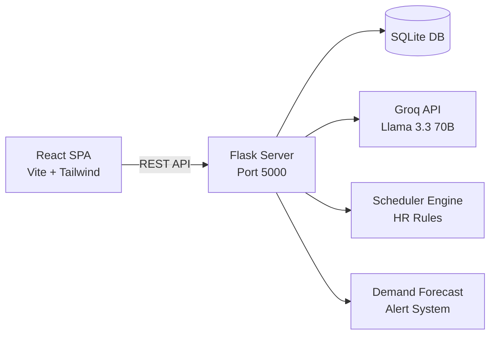

# 💊 Pharma RH Agent — AI-Powered HR Management


> **Système intelligent de gestion RH pour pharmacie** avec planification automatique, chatbot IA, analytics avancés et export PDF.

---

## ✨ Features

| Feature | Description |
|---------|-------------|
| 📊 **Dashboard Interactif** | KPIs en temps réel, graphiques de couverture hebdomadaire, répartition par rôle (Recharts) |
| 👥 **Gestion Employés** | CRUD complet, compétences avec niveaux, statut actif/inactif |
| 📅 **Planning Automatique** | Algorithme intelligent avec respect des règles RH (repos 11h, max heures, absences) |
| 📝 **Gestion Absences** | Demandes, approbations, refus avec notifications toast |
| 🤖 **Chatbot IA (Groq Llama 3.3)** | NLP français + IA conversationnelle pour requêtes complexes |
| 📈 **Analytics** | Workload distribution, skill matrix, absence trends, overtime alerts |
| 📄 **Export PDF** | Plannings hebdomadaires en PDF branded |
| 🎨 **UI Premium** | Framer Motion animations, toasts, loading spinners, backdrop blur modals |

---

## 🏗️ Architecture



### Directory Structure

```
pharma-rh-agent-main/
├── backend/
│   ├── app.py                  # Flask API (health, dashboard, employees, planning, absences, chat, analytics)
│   ├── seed.py                 # DB initialization + demo data
│   ├── .env                    # Groq API key & model config
│   ├── models/db.py            # SQLite connection utilities
│   └── services/
│       ├── agent.py            # NLP intent parser + Groq AI fallback
│       ├── scheduler.py        # Automated weekly schedule generator
│       ├── demand_forecast.py  # Customer demand analysis & alerts
│       └── rules.py            # HR rules (rest hours, max hours, absences)
│
├── frontend/
│   ├── src/
│   │   ├── App.jsx             # Root with sidebar, routing, Framer Motion, toasts
│   │   ├── api.js              # Axios API client
│   │   └── pages/
│   │       ├── Dashboard.jsx   # KPIs + Recharts (bar, pie)
│   │       ├── Employees.jsx   # Employee management + skills
│   │       ├── Planning.jsx    # Weekly schedule + PDF export
│   │       ├── Absences.jsx    # Absence management
│   │       ├── Analytics.jsx   # Workload, skills matrix, trends
│   │       └── Chat.jsx        # AI chatbot (Groq Llama 3.3)
│   └── package.json
│
└── README.md
```

---

## 🚀 API Endpoints

| Method | Endpoint | Description |
|--------|----------|-------------|
| `GET` | `/api/health` | Health check + version info |
| `GET` | `/api/dashboard` | Dashboard KPIs, charts, coverage |
| `GET` | `/api/employees/all` | All employees + skills |
| `POST` | `/api/employees` | Add new employee |
| `POST` | `/api/employees/:id/toggle` | Toggle active status |
| `POST` | `/api/employees/:id/skills` | Update employee skills |
| `GET` | `/api/planning/all` | Weekly planning + assignments |
| `POST` | `/api/planning/generate` | Auto-generate schedule |
| `GET` | `/api/absences/all` | All absences |
| `POST` | `/api/absences/request` | Request absence |
| `POST` | `/api/absences/:id/approve` | Approve absence |
| `POST` | `/api/absences/:id/reject` | Reject absence |
| `POST` | `/api/chat` | AI chatbot (NLP + Groq) |
| `GET` | `/api/analytics` | Workload, skills, trends |

---

## ⚙️ Setup & Installation

### Prerequisites
- Python 3.9+
- Node.js 18+

### Backend

```bash
cd backend
python -m venv .venv
.venv\Scripts\Activate.ps1        # Windows
pip install -r requirements.txt
python seed.py                     # Initialize DB
python app.py                      # Start API on :5000
```

### Frontend

```bash
cd frontend
npm install
npm run dev                        # Start on :5173
```

---

## 🤖 AI Integration

The chatbot uses a **dual-layer NLP approach**:

1. **Fast Path (Regex)** — Structured commands like `génère planning`, `dispo 2026-03-05` are parsed instantly via regex
2. **AI Fallback (Groq Llama 3.3 70B)** — Any natural language query falls through to the LLM, which receives full database context (employees, absences, shifts) for intelligent, context-aware responses

---

## 🧪 Testing

```bash
cd backend
pip install pytest pytest-flask
python -m pytest tests/test_app.py -v
```

---

## 📦 Tech Stack

| Layer | Technologies |
|-------|-------------|
| **Frontend** | React 19, Vite, Tailwind CSS, Recharts, Framer Motion, jsPDF, html2canvas, Lucide |
| **Backend** | Python 3.9+, Flask, SQLite, Groq SDK, python-dotenv |
| **AI** | Groq Cloud, Llama 3.3 70B Versatile |

---

<p align="center">
  <strong>Built with ❤️ for pharmacy HR management</strong><br/>
  <sub>© 2026 Pharma RH Agent · v2.0</sub>
</p>
